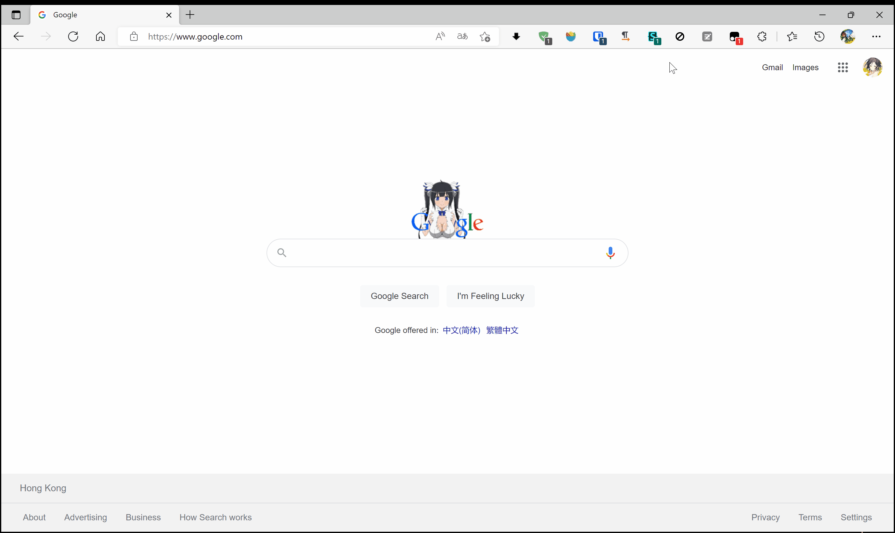

# vite-userscript-template

[README](README.md) | [中文文档](README_zh.md)

a simple example with [vite-plugin-monkey](https://github.com/lisonge/vite-plugin-monkey)

## usage

```shell
git clone https://github.com/lisonge/vite-userscript-template.git
cd vite-userscript-template
pnpm install
pnpm run dev
# install userscript in open browser tab
```

then open <https://www.google.com/> will see Effects

## screenshot


