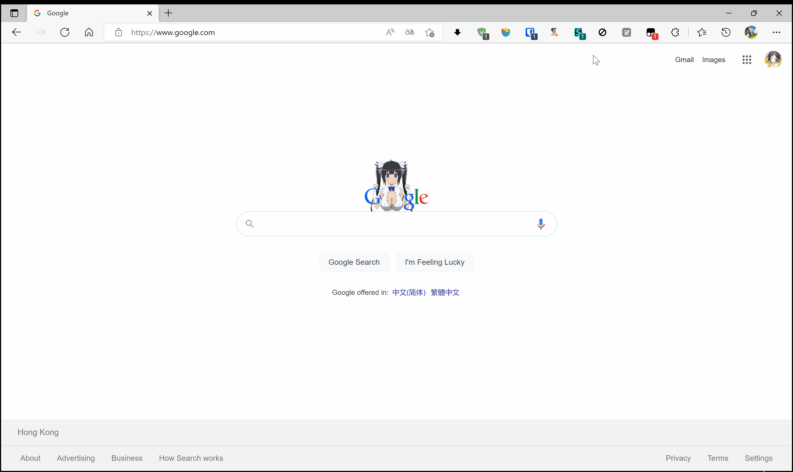

# vite-userscript-template

[README](README.md) | [中文文档](README_zh.md)

一个简单的使用 [vite-plugin-monkey](https://github.com/lisonge/vite-plugin-monkey) 的示例

## 用法

```shell
git clone https://github.com/lisonge/vite-userscript-template.git
cd vite-userscript-template
pnpm install
pnpm run dev
# 在新打开的标签页里安装脚本
```

然后打开 <https://www.google.com/> 即可看到效果

## 截屏


